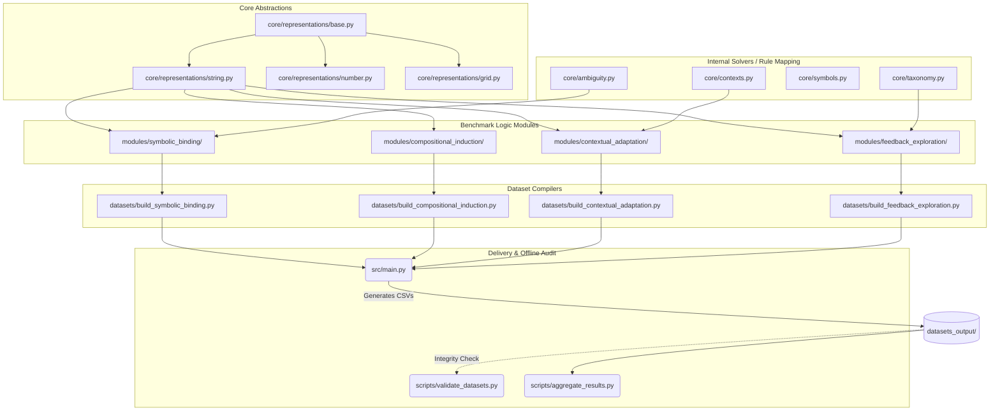

# FluidLearn: A Procedural Benchmark for Learning, Adaptation, and Transfer Under Novelty 


## Problem Statement

Existing benchmarks mostly evaluate static performance or one-shot reasoning (Chollet, 2019; DeepMind, 2023), making it hard to isolate learning as a dynamic process. FluidLearn instead uses the dynamic approach: multi-round symbolic rule learning under controlled novelty. Because episodes are procedurally generated from transformation rules, the benchmark reduces contamination risk and provides deterministic, verifiable ground truth.

We focus on four questions:
1. Acquisition: Can a model acquire a rule from a few examples?
2. Efficiency: Can a model improve efficiently as evidence accumulates?
3. Adaptation: Can a model recover after a rule shift?
4. Transfer: Can a model transfer the learned rule to a held-out example?


## Benchmark Construction

### Representations

| **Representation** | **Encoding Format**                                                                                                               | **Rationale and Operational Focus**                                                                                                                |
| ------------------ | --------------------------------------------------------------------------------------------------------------------------------- | -------------------------------------------------------------------------------------------------------------------------------------------------- |
| String             | Pronounceable pseudo-words constructed from specific consonant-vowel patterns (e.g., CVC, CVCV, CVCCV). Examples: "baf", "tashu". | We want to minimize or make it hard for model to rely on memorization.                                                                             |
| Number             | Space-separated sequences of fundamental digits (0-9). Example: `1 2 3`.                                                          | More diverse data format, we will treat number as abstract token without its semantic meaning.                                                     |
| Serialized 2D Grid | Flat JSON formatting of restricted integer matrices. Example: `[1, 2]`.                                                           | Connects abstract logic to visual and spatial manipulation tasks (e.g., Sudoku, matrix transformation), evaluating padding, slicing, and rotation. |


### Abstract Primitives
Below are the primitives that define the rule in each sample.

| **Primitive** | **String Implementation**                                | **Number Implementation** | **Grid Implementation**                                                    |
| ------------- | -------------------------------------------------------- | ------------------------- | -------------------------------------------------------------------------- |
| Permutation   | Total reversal of token order.                           | Same as String.           | Matrix transposition (swapping rows and columns).                          |
| Reindexing    | Positional rotation by k offset.                         | Same as String.           | Cyclic shifting of specific rows or columns.                               |
| Iteration     | Complete sequence duplication.                           | Same as String.           | Spatial tiling along designated grid axes.                                 |
| Partitioning  | Filtering and retention based on even/odd token index.   | Same as String.           | Quadrant extraction and spatial cropping.                                  |
| Extension     | Boundary padding by appending the first or last element. | Same as String.           | Symmetrical boundary padding using a constant integer.                     |
| Reduction     | Isolation of the statistical majority token.             | Same as String.           | Matrix flattening to a 1D array or extraction of a core summary statistic. |

### Contextual Primitives

Module III uses _contextual primitives_ that define conditions mapping to rules, encouraging the model to detect context and adapt.  Examples include:

- **Size parity:** even/odd length sequences.
- **Repetition presence:** whether the sequence contains duplicates.
- **Boundary relation:** whether the first and last items are identical.
- **Majority existence:** whether a majority item exists.
- **Local pattern consistency:** whether items at even and odd positions are consistent.

Each context type is paired with an associated transformation rule, requiring the model to identify the context and apply the correct rule.

### Modules
FluidLearn is partitioned into four primary cognitive modules:

| **Module**                         | **Description**                                                                                                                                                                                                                                                                                                                                                         | sub-abilities measured                                                                                                                                                                            | **Example**                                                         |
| ---------------------------------- | ----------------------------------------------------------------------------------------------------------------------------------------------------------------------------------------------------------------------------------------------------------------------------------------------------------------------------------------------------------------------- | ------------------------------------------------------------------------------------------------------------------------------------------------------------------------------------------------- | ------------------------------------------------------------------- |
| Module I: Symbolic Binding         | A single primitive rule is sampled (e.g., reverse).  The model sees a fixed query and receives incremental support examples across 5 rounds (pre‑shift) followed by 5 rounds (post‑shift) after rule changes.  The model must answer the query after each round and is evaluated on its improvement.                                                                    | 1. **concept formation** (infer a new rule from examples)<br>2. **associative learning** (link input–output pairs)<br>3. **observational learning** (update hypotheses from new examples).        | ab → ba reverse                                                     |
| Module II: Compositional Induction | Extends Module I to compositions of  up to two primitives.  The model must infer a multi-steps transformation, such as rotating then appending.                                                                                                                                                                                                                         | 1. **concept formation** (learn multi‑step rules)<br>2. **procedural learning** (execute a sequence of operations)<br>3. **observational learning** (combine new examples into a composite rule). | ab → baab (reverse + append)                                        |
| Module III: Contextual Adaptation  | Tests context‑sensitive learning.  A mapping from context to rule family is sampled (e.g., if the length is even, reverse; if odd, append).  The model must infer the conditional mapping.  A rule shift is introduced at post‑shift (different context rule pair).                                                                                                     | 1.  **associative learning** (learn context–rule pairs)                                                                                                                                           | if len even: reverse<br>if odd: append <br><br>abc → abcabc         |
| Module IV: Feedback Exploration    | Rather than predicting the output directly, the model must select which primitive to apply.  It is given a toolbox of candidate primitives with example input–output pairs (the “manual”).  During each round the model answers Query A by selecting an operation (via JSON), receives feedback (Correct/Incorrect + hint), and sees the result of applying its choice. | 1. **reinforcement learning** (use feedback to improve future actions)<br>2. **procedural learning** (select the right operation)                                                                 | choose op: reverse ❌ <br>hint: “length increases” → choose append ✅ |

### Representational Modalities
To decouple pure logical intelligence from specific domain syntaxes, tasks are presented across three independent encoding formats:
1. **String**: Pronounceable pseudo-words computationally generated via CVC patterns (e.g., *baf*, *tashu*).
2. **Number**: Arbitrary space-separated integer sequences stripped of semantic numeric value or scale.
3. **Serialized 2D Grid**: Flat JSON arrays representing constrained integer matrices, enforcing spatial logic akin to pure visual reasoning tasks.

## Code Structure & Pipeline

The backend sequentially samples primitive profiles, formulates random token maps, evaluates internally to ascertain ground-truth correctness, and orchestrates the pre/post-shift formats.

### Directory Walkthrough
* `src/main.py`: The global entrypoint that aggregates builders and sequentially generates the multi-modal dataset.
* `src/core/`: The functional brain of FluidLearn.
  * `representations/ (base.py, grid.py, string.py, number.py)`: Submodules defining the primitive logic (e.g., how "reverse" physically manipulates a string vs a 2D array).
  * `ambiguity.py`: Employs solver checks against all known structural rules to prevent combinatorial overlap ensuring strict problem identifiability.
  * `difficulty.py` & `sampling.py`: Dictates how hard procedural token arrays can be while ensuring mathematical feasibility.
  * `symbols.py`: Generates the underlying CVC pseudo-words and unique context mapping arrays.
  * `taxonomy.py`: Maps the primitive rules defined across representation branches into global searchable configurations for the RL module.
* `src/modules/`: Defines the explicit structural layouts to construct valid "episodes" for each of the 4 benchmark tests (Symbolic Binding, Compositional Induction, Contextual, Feedback Exploration).
* `src/datasets/`: Top-level orchestrators that construct the `csv` dataset outputs row-by-row utilizing the `src/modules/` architectures mapping the logic to CSV column headers.
* `src/evaluation/`: Contains the simulation harnesses ensuring interactive verifiability.
* `scripts/`: Production tools for deploying and aggregating final LLM run results.
  * `aggregate_results.py`: Computes high resolution analysis logic like "Shift Shock" and generates notebook payload data.
  * `validate_datasets.py`: Defensive script ensuring pre-compiled representations meet integrity thresholds entirely decoupled from normal benchmarking tasks.

### Architecture Topology



## Quick Start Configuration

```bash
# 1. Procedurally generate the benchmark dataset payload (outputs to `datasets_output/`)
python3 src/main.py

# 2. Defensively verify the integrity of the generated challenges
python3 scripts/validate_datasets.py

# 3. Compile output inferences and compute shift-shock aggregates
python3 scripts/aggregate_results.py
```

### Simulation / Interactive Debugging
To explore exactly how the benchmark environments behave for the model agents, run the interactive simulators iteratively via standard python input loops.
```bash
# Play an interactive test sequence for Modules I - III
PYTHONPATH=src python3 src/evaluation/prompt/demo_static_learning.py --module symbolic_binding --representation string

# Navigate the Feedback Exploration simulated environment (Module IV)
PYTHONPATH=src python3 src/evaluation/prompt/demo_feedback_learning.py --representation string
```
